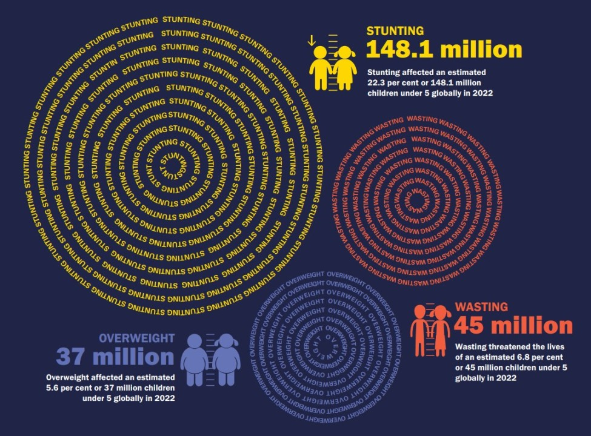
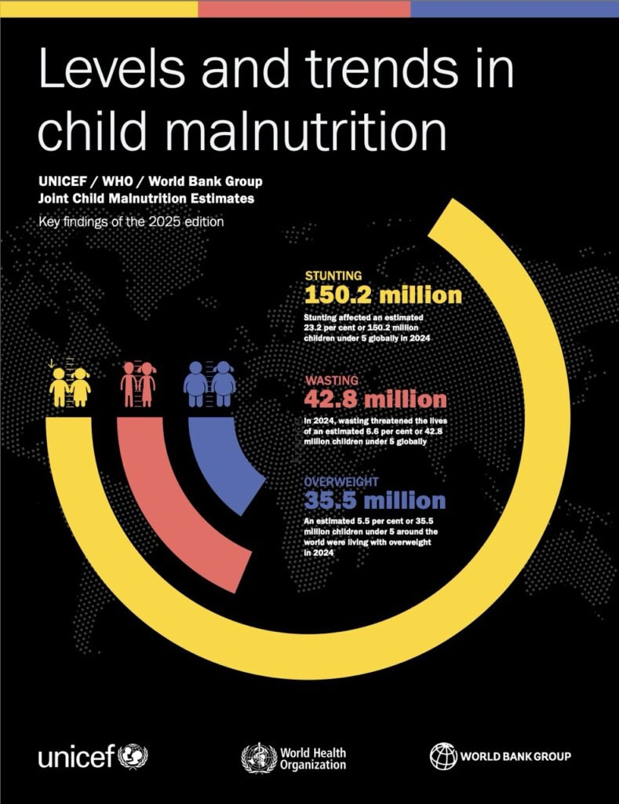

# Market Analysis Report: NourishNet
#
**Authors:**
- Muditha Kumara (<muditha.chinthana@centria.fi>)
- Jony Ahammad (<jony.ahammad@centria.fi>)
- Tahbir.Moon (<tahbir.moon@centria.fi>)

**Project:** NourishNet – Digital Platform to Combat Childhood Insecurity
**Phase 1 Focus:** Real-time, Transparent Delivery of Food Aid to Children

## 1. Assessment of Commercial Success Potential

The commercial and social success potential for NourishNet is assessed as **High**. Success is defined by the platform's ability to achieve large-scale adoption, sustainable operation, and measurable social impact, particularly in its initial food delivery phase and subsequent expansion (NourishNet Project Proposal, 2025).

The following charts illustrate the Real-Data Chart & Trend (Last 5 Years), demonstrating the scale and urgency of global child malnutrition:

### Market Drivers

The project addresses a non-discretionary and globally urgent issue. By focusing on the foundational need of food (Phase 1) before expanding to health and education (Phase 2), the platform establishes immediate, critical value.

  * **Massive, Urgent Market Need:** The problem is widespread and severe. According to the World Health Organization (WHO), over 150 million children under five suffer from stunting, and 42.8 million from wasting (WHO, 2024). This scale ensures a constant, compelling demand for a viable solution.
  * **Systemic Value Proposition:** The user's vision to solve food insecurity as the first step is critical. A healthy, educated global population will lead to reduced defense, border control, and welfare expenditures for developed nations, making the platform a high-value social investment (NourishNet Project Proposal, 2025).

### Financial Viability (Initial Assessment)

The funding model is designed for sustainability through transparency and diverse revenue streams.

  * **Donor Confidence and Transparency:** The model acts as a transparent **escrow service**, transferring funds directly to the Food Provider upon successful order completion *without* taking a commission. This maximizes donor value and confidence (NourishNet Project Proposal, 2025).
  * **Robust Funding Streams:** The platform targets high-value funding sources, including corporate social responsibility (CSR) budgets and large-scale grants, which are continuously allocated to combat global food insecurity.

## 2. Differentiation from Similar Solutions

NourishNet differentiates itself from traditional food banks and non-governmental organizations (NGOs) by leveraging technology to shift from a centralized, passive aid model to a **decentralized, active, and hyper-local network** (NourishNet Project Proposal, 2025).

| Feature | Traditional Food Banks & NGOs | NourishNet (Our Solution) |
| :--- | :--- | :--- |
| **Distribution Model** | Centralized, warehouse-based, often requiring recipients to travel; slow and inflexible. | **Decentralized, Hyper-local:** Connects local food providers (restaurants, individual volunteers) directly to children via a real-time request system. |
| **Transparency & Data** | Manual tracking; limited donor visibility on the final use of funds. | **Full Transparency:** Donors track their money to the exact meal delivery; the platform tracks **meals-per-child** with measurable impact data. |
| **Fulfillment Process** | Generalized aid distribution; lack of flexibility for individual, time-sensitive needs. | **On-Demand & Specific:** Requests include required time, location, and specific dietary needs, ensuring timely delivery of specific, nutritious items (NourishNet Project Proposal, 2025). |
| **Community Role** | Community members are passive, primarily acting as distant donors or generic recipients. | **Active Network:** Mobilizes all stakeholders—requesters, providers, donors, and administrators—to form a coordinated, local delivery network, fostering greater **engagement and ownership**. |

**Key Differentiator:** The platform is the first step toward a global solution for childhood insecurity (food, health, and education). It achieves this by creating a **transparent, direct-to-child supply chain** that minimizes logistical overhead and maximizes the impact of every donated unit.

## 3. Potential Corporate Partners in the Region

The following companies are strong candidates for partnership due to their established corporate social responsibility (CSR) programs, logistical capabilities, or philanthropic models. These are examples based on global industry leaders with significant regional presence.

| Company | Alignment and Interest | Potential Contribution to NourishNet |
| :--- | :--- | :--- |
| **1. Salesforce** | Pioneer of the **1-1-1 Philanthropy Model** (1% equity, 1% product, 1% employee time). Highly aligns with the open-source, social enterprise nature of NourishNet (Salesforce, 2024). | Pro-bono **CRM tools** for managing the transparent donor ledger, impact reporting, and employee volunteering for technical and strategic support. |
| **2. Uber / Bolt / Local Delivery Network** | Possesses the existing logistical network, real-time routing technology, and large volunteer/driver base necessary for final-mile delivery. | Integration of their delivery APIs for the fulfillment phase and offering discounted or free delivery services as part of their CSR. |
| **3. Major Regional Restaurant/Hotel Group** | Has high-volume food preparation capacity, existing health/safety vetting, and significant food waste that could be redirected. | Registers as a verified **Food Provider** business, donating surplus healthy meals, and offering kitchen facilities for volunteer preparation days. |
| **4. World Health Organization (WHO) / UNICEF** | Global mandate to address childhood health and nutrition. Could provide access to data and a powerful validation/distribution channel. | Provides clinical/nutritional standards for food provision and acts as a strategic global partner for **Phase 2 expansion** (medical and education aid). |

Here are 5 global companies that align with NourishNet's mission and would be ideal for partnerships, CSR initiatives, or pilot programs.
1. **Unilever (UK/Netherlands):** Aligned with Unilever Foundation and Sustainable Living Plan. Brands like Knorr and Hellmann’s fight food waste and malnutrition. Collaboration could include product donations, funding, and employee volunteering.
2. **Tesla, Inc. (USA):** Through its Tesla Impact Report, Tesla supports community investment. They could fund local NourishNet hubs and donate electric vehicles for eco-friendly food deliveries.
3. **IKEA (Netherlands):** The IKEA Foundation supports children and climate-related initiatives. IKEA stores could host NourishNet coordination hubs and share logistics expertise.
4. **McDonald’s Corporation (USA):** Ronald McDonald House Charities already aids children’s welfare. McDonald’s could donate unsold, healthy food items directly to children through NourishNet’s network.
5. **Salesforce (USA):** Their 1-1-1 Philanthropy Model matches NourishNet’s mission. Salesforce could offer free CRM tools for managing donors and impact tracking, plus employee volunteering for tech and strategy support.

## 4. Strategic Analysis (SWOT)

A formal Strength, Weakness, Opportunity, and Threat (SWOT) analysis was performed to assess NourishNet's strategic position in the social enterprise and non-profit technology space.

| Factor | Analysis | Implication for NourishNet |
| :--- | :--- | :--- |
| **Strengths** | **S1: Transparent Escrow Model.** Minimizes fraud and maximizes donor confidence by guaranteeing funds only pay for verified, delivered meals. **S2: Hyper-Local Agility.** Decentralized, on-demand network enables faster response times and caters to specific needs (dietary, time-sensitive) better than centralized warehouses. **S3: High Scalability.** Built on a digital platform, the model can be replicated quickly across new geographies with minimal initial logistical overhead. | Core competitive advantage against traditional NGOs. Essential for securing large, trust-based grants and attracting tech-forward partners like Salesforce. |
| **Weaknesses** | **W1: Reliance on Local Partners.** Success hinges on the consistent availability and commitment of local food providers and delivery volunteers (e.g., local restaurants, Uber/Bolt drivers). **W2: Data Security & Privacy.** Handling sensitive location data and recipient information requires rigorous, compliant security protocols and significant initial investment. **W3: Initial Trust Gap.** As a new platform, it must aggressively prove its transparency and impact to break through the market saturation of established NGOs. | Requires robust partnership agreements and a comprehensive cybersecurity strategy. Pilot programs must focus on measurable, unassailable success metrics. |
| **Opportunities** | **O1: Phase 2 Expansion.** Established food aid (Phase 1) creates a validated user base for expansion into high-value health and education aid (Phase 2). **O2: AI/Data Leverage.** Utilize collected real-time data to optimize supply chains, forecast demand, and predict future crisis zones, creating a high-value insight service for global organizations (WHO, UNICEF). **O3: Government/Grant Funding.** The urgency of the malnutrition crisis ensures a constant and massive pool of funding from international bodies (WHO, UNICEF) and large foundations. | Key to long-term financial sustainability beyond just transactional donations. Positions NourishNet as a critical data/intelligence provider, not just an aid distributor. |
| **Threats** | **T1: Regulatory Hurdles.** Varying food safety, delivery, and NGO registration laws across different regions may slow global expansion. **T2: Competition from Established Giants.** Large, well-funded NGOs could attempt to replicate the technology, leveraging their existing brand recognition and field presence. **T3: Economic Instability.** Global recessions or local economic shocks can reduce individual donation volumes and corporate CSR budgets. | Requires dedicated legal/compliance resources for scaling and a focus on patenting key technological processes (e.g., the escrow/tracking module) to maintain differentiation. |

## 5. Detailed Financial Projections and Costs (Structure)

To provide a complete assessment of financial viability, the following structure will be used for Phase 1 (First 12 Months) projections:

### A. Phase 1 Startup Costs (Estimated)

| Cost Category | Description | Funding Source |
| :--- | :--- | :--- |
| **Platform Development** | Minimum Viable Product (MVP) development, backend infrastructure, user interface (requester/provider/donor) and core escrow/tracking module. | Seed Grants, Angel Investors |
| **Legal & Compliance** | Regional NGO registration, data privacy (GDPR/local equivalents) compliance, and food safety standards verification. | Foundation Grants |
| **Initial Outreach/Pilot** | Onboarding of first 100 Food Providers and launch marketing for the first target region. | CSR Budgets, Donor Campaigns |

### B. Phase 1 Operational Costs (Projected Annual)

| Cost Category | Description | Percentage of Total Budget |
| :--- | :--- | :--- |
| **Core Admin & Tech Staff** | Salaries for 3-5 key roles (Project Manager, Lead Developer, Financial Oversight, Partner Relations). | 40–50% |
| **Technology/Cloud Hosting** | Cloud services (AWS/Azure), database maintenance, security monitoring, and CRM tools (if not pro-bono from Salesforce). | 10–15% |
| **Operational Support** | Transaction fees (for non-escrow payments), professional services (auditing), and office/coordination space (if needed). | 15–20% |
| **Buffer/Contingency** | Unforeseen operational costs, currency fluctuations, and technology failure reserve. | 15–20% |

### C. Revenue Streams & Funding Targets

| Revenue Stream | Target Allocation (Initial 12 Months) | Note |
| :--- | :--- | :--- |
| **Large-Scale Grants** | 50% | Targeting international foundations (e.g., Gates Foundation) and government bodies (WHO/UNICEF) for core platform infrastructure and expansion capital. |
| **Corporate Partnerships (CSR)** | 35% | Secured through the partners identified in Section 3 (e.g., Salesforce, Unilever, Tesla) for specific program funding or in-kind donations. |
| **Individual Donations** | 15% | Maintained through the transparent, real-time tracking dashboard to build public trust and sustained monthly giving. |

## 6. Sustainable Development Model (University Support)

To ensure low-cost, high-quality development and continuous improvement, NourishNet will strategically partner with universities and academic institutions, utilizing student capstone projects and coursework for modular development and support.

### Governance and Project Integration

The model will follow an **Open-Source Governance** structure to ensure project integrity and quality while minimizing operational costs:

1.  **Project Assignment:** The core NourishNet team defines a clear, modular project (e.g., specific API endpoint, UI/UX module).
2.  **Student Development:** University student teams complete the project, adhering to predefined technical and security standards.
3.  **Submission:** The work is submitted as a **Pull Request (PR)** to the main code repository.
4.  **Initial Vetting:** A student/volunteer team is assigned the task of performing a **Manual PR Request Check** to review code, documentation, and execute automated tests, acting as a crucial triage layer.
5.  **Final Decision Gate (5 Admins):** The **five Core Administrators** (e.g., Lead Developer, Security Officer, Product Owner, Strategy Lead, Academic Partner) have the ultimate authority to review, approve, and **Merge** the code into the working project, maintaining quality and security.

This approach minimizes payroll costs (OpEx) while maximizing access to new technical talent and cutting-edge solutions.

## 7. Conclusion and Recommendations

The NourishNet platform demonstrates a high potential for commercial and social success by applying a unique, technological solution to a massive, urgent global problem. Its core value proposition—**100% transparent, hyper-local, real-time aid delivery**—provides a decisive competitive edge over conventional, centralized aid models.

### Key Recommendations (Next 6 Months)

* **Finalize Anchor Partnerships:** Immediately pursue final agreements with key partners identified in Section 3, specifically **Salesforce** (for pro-bono CRM and technical support) and **Uber/Bolt** (for final-mile delivery API integration).
* **Secure Seed Funding:** Target a 500,000usd to $1 million seed grant or investment to cover Phase 1 MVP development and legal compliance costs. Focus pitch on the platform's high transparency and scalability (O1, S1).
* **Launch University Support Pilot:** Initiate the sustainable development model by establishing a formal partnership with an academic institution to handle initial project modules, such as the **PR Request Manual Check** and a **Vetting Portal** for food providers.
* **Develop Phase 2 Roadmap:** Create a detailed blueprint for the integration of health and education aid, including technology requirements and data standards, to leverage existing Phase 1 user base and position NourishNet for long-term growth (O1).
* **Establish Legal/Compliance Framework:** Proactively secure all necessary legal registrations and develop a robust data security architecture to mitigate potential regulatory and privacy risks (W2, T1).

-----

# REFERENCES

NourishNet Project Proposal. 2025. *Project Proposal: NourishNet.* Available at: https://github.com/Muditha-Kumara/CapstoneProject2/blob/main/docs/PROJECT_PROPOSAL.md. Accessed 15 November 2025.

IKEA Foundation. 2024. *Fighting poverty and climate change. Every child has the right to a bright and healthy future.* Available at: https://www.ikea.com/us/en/this-is-ikea/about-us/fighting-poverty-and-climate-change-pube54f4af6/. Accessed 15 November 2025.

Ronald McDonald House Charities (RMHC). 2024. *About Us.* Available at: https://ronaldmcdonaldhouse.org/. Accessed 15 November 2025.

Salesforce. 2024. *The 1-1-1 Model. Giving Back is in Our DNA.* Available at: https://www.salesforce.com/company/philanthropy/. Accessed 15 November 2025.

Tesla. 2024. *Impact.* Available at: https://www.tesla.com/impact. Accessed 15 November 2025.

Unilever. 2024. *Tackling food waste.* Available at: https://www.unilever.com/sustainability/responsible-business/tackling-food-waste/. Accessed 15 November 2025.

World Health Organization (WHO). 2024. *Levels and Trends in Child Malnutrition: Key Findings.* Available at: https://www.who.int/data/gho/data/themes/topics/topic-details/GHO/child-malnutrition-. Accessed 15 November 2025.

