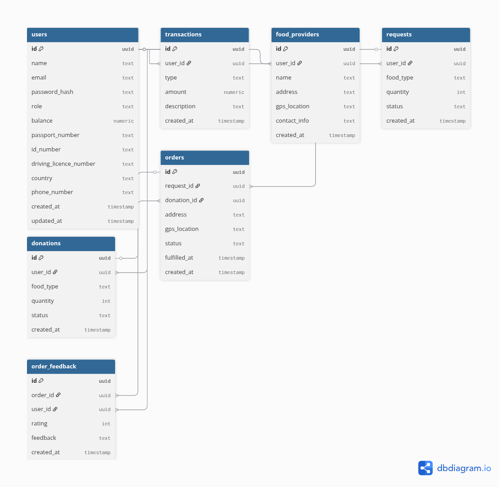

# NourishNet Database Schema Documentation

## Overview

This schema is designed for the NourishNet platform, supporting donors, recipients, and food providers. It follows best practices for normalization, indexing, and data integrity.

## Entity Relationship Diagram (ERD)



You can also view or edit the ERD directly in the file: [NourishNet_ERD.dbdiagram](./NourishNet_ERD.dbdiagram)

Or view it online: [dbdiagram.io ERD](https://dbdiagram.io/d/68ccacb05779bb72652c3910)

```plaintext
Table users {
  id uuid [pk]
  name text
  email text [unique]
  password_hash text
  role text
  balance numeric
  passport_number text
  id_number text
  driving_licence_number text
  country text
  phone_number text
  created_at timestamp
  updated_at timestamp
}

Table transactions {
  id uuid [pk]
  user_id uuid [ref: > users.id]
  type text
  amount numeric
  description text
  created_at timestamp
}

Table food_providers {
  id uuid [pk]
  user_id uuid [ref: > users.id]
  name text
  address text
  gps_location text
  contact_info text
  created_at timestamp
}

Table requests {
  id uuid [pk]
  user_id uuid [ref: > users.id]
  food_type text
  quantity int
  status text
  created_at timestamp
}

Table donations {
  id uuid [pk]
  user_id uuid [ref: > users.id]
  food_type text
  quantity int
  status text
  created_at timestamp
}

Table orders {
  id uuid [pk]
  request_id uuid [ref: > requests.id]
  donation_id uuid [ref: > donations.id]
  address text
  gps_location text
  status text
  fulfilled_at timestamp
  created_at timestamp
}

Table order_feedback {
  id uuid [pk]
  order_id uuid [ref: > orders.id]
  user_id uuid [ref: > users.id]
  rating int
  feedback text
  created_at timestamp
}
```

## Entities & Relationships

- **Users**: Core entity for donors, recipients, and providers. Has a `balance` for donor deposits. Includes passport, ID, driving licence, country, and phone number fields (not mandatory for donors).
- **FoodProviders**: Linked to Users, represents organizations/individuals providing food. Includes address, GPS location, and contact info.
- **Requests**: Food requests made by users (recipients). Status managed via ENUM.
- **Donations**: Food donations made by users (donors). Status managed via ENUM.
- **Orders**: Connects requests and donations, tracks fulfillment. Includes address and GPS location.
- **Transactions**: Records deposits and deductions for donor accounts.
- **OrderFeedback**: Stores feedback and ratings for orders, linked to both orders and users.

## Constraints & Validation

- UUIDs for all primary keys.
- Foreign keys for relationships, with `ON DELETE CASCADE` for referential integrity.
- ENUM types for status fields to restrict allowed values.
- Unique constraint on user email.
- Quantity fields must be positive integers.
- Role field restricted to allowed values.
- Rating in feedback must be between 1 and 5.

## Indexing Strategy

- Indexes on foreign keys and status columns for fast queries.
- Composite indexes can be added for advanced reporting if needed.

## Data Types

- `TEXT` for names, emails, addresses, contact info, and descriptions.
- `NUMERIC(12,2)` for monetary values.
- `TIMESTAMP WITH TIME ZONE` for all date/time fields.
- `INTEGER` for quantities and ratings.
- `UUID` for primary and foreign keys.

## Seeding Strategy

- Initial seed data for users, providers, transactions, requests, donations, orders, and feedback.
- Use realistic values for development and testing.

## Schema Decisions

- Separation of transactions for auditability and transparency.
- Use of ENUMs for workflow management.
- Cascade deletes to maintain data consistency.
- Feedback stored in a separate table for scalability.

## Future Considerations

- Add audit logs for sensitive actions.
- Expand ENUMs as workflows evolve.
- Add composite indexes for analytics.
- Support for additional feedback types or attachments.
